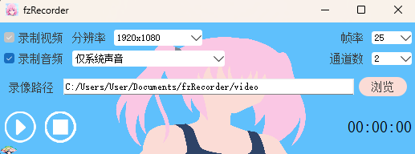

# fzRecorder - Screen recording software based on QT + FFmpeg
[中文 Readme](README_zh.md)

Revezone is currently in a public beta. Please report a [issue](https://github.com/dulred/fzRecorder/issues/new), if you have any suggestions or questions.

---
Screen recording software based on QT + FFmpeg.


## Process

Main thread: UI thread, calling the Recorder interface
Acquisition thread: After acquiring the frame -> format conversion/resample -> write to FIFO
Encoding multiplexing thread: loop read frames from FIFO -> encode -> write to file

## Environment
### windows
VS：推荐VS2017以后的版本 
Qt：推荐Qt5.12以后的版本 
FFmpeg5.1（项目已包含，生成项目后dll会自动拷贝到exe目录）

我的开发环境
- VS2022
- Qt5.12.9 
  

解决方案支持Debug/Release和Win32/x64 
</br>
[VS+Qt开发环境配置](./doc/VS%2BQt%E5%BC%80%E5%8F%91%E7%8E%AF%E5%A2%83.pdf)

### linux
我的开发环境
- Qt6.2.4
- FFmpeg5.1.2

<font color=red>注意：</font>
目前linux下录音用到了PulseAudio，ffmpeg默认是不支持PulseAudio的，所以要手动编译ffmpeg，`./configure`时添加`--enable-libpulse`，具体编译参考如下文档  
[ffmpeg build reference](./doc/ffmpeg_build.md)

需要在CMakeLists.txt里修改Qt和FFmpeg的依赖路径
- QT_PATH
- FFMPEG_ROOT_DIR（你编译的ffmpeg根目录）

#### Build
```cpp
mkdir build && cd build
cmake ..
make -j4
```

#### RUN
1. 直接用Qt Creator运行  
2. 命令行启动：`../bin/NanaRecorder`  


## Sponsor
[Buy me a coffee]https://buymeacoffee.com/dulred41790) or [feed my cat（大陆用户）](https://github.com/dulred/donate).

## Giving a Star
Please give it a star ⭐ ☝️ if fzRecorder is helpful to you.

## Using Revezone
* Online Try Version (Data stored in browser): https://fzRecorder.com
* Desktop App Version (Data store in local): https://github.com/dulred/fzRecorder/releases

## Reporting a Issue
fzRecorderis currently in a public beta. Please report a [issue](https://github.com/revezone/revezone/issues/new), if you have any suggestions or questions.

## Features
* Excalidraw Board: A whiteboard function based on Excalidraw.
* Tldraw Board: A whiteboard function base on Tldraw.
* Note: A Notion-like note-taking function.
* File Management: You can manage notes or boards based on folder.

### Excalidraw Board
Board in Revezone is a white board based on Excalidraw. You can use Excalidraw in a new easier way in Revezone, even customing fonts in desktop app and linking notes in Revezone through double link.


#### Custom Fonts in Excalidraw Board
Revezone app supports customing fonts in Revezone board. You can upload fonts you like in Revezone app.

Operation Method:
> Click setting button at the bottom sidebar to custom a font in boards.


### Tldraw Board
Revezone newly supports Tldraw whiteboard.


### Note
Note in Revezone is a WYSIWYG Notion-like editor，supports '/' Command and Markdown syntax.


### File Management
You can create and manage a folder/note/board in the left sidebar.


### Flex layout
You can sort directories and split screens by dragging and dropping.


## About this repo
This repository only includes the basic functionality code of Revezone and does not completely correspond to the capabilities provided by revezone.com and the Revezone desktop application.
## TODO
- [ ] 画质高，文件小，码率低  
- [ ] flush编码器  
- [X] 支持同时录制扬声器和麦克风  
- [ ] 支持硬编码
## Future Planning
More useful features are developing. You can get more information and developing stories from [Twitter](https://x.com/DulredY62423) or [Bilibili](https://space.bilibili.com/359044839).
